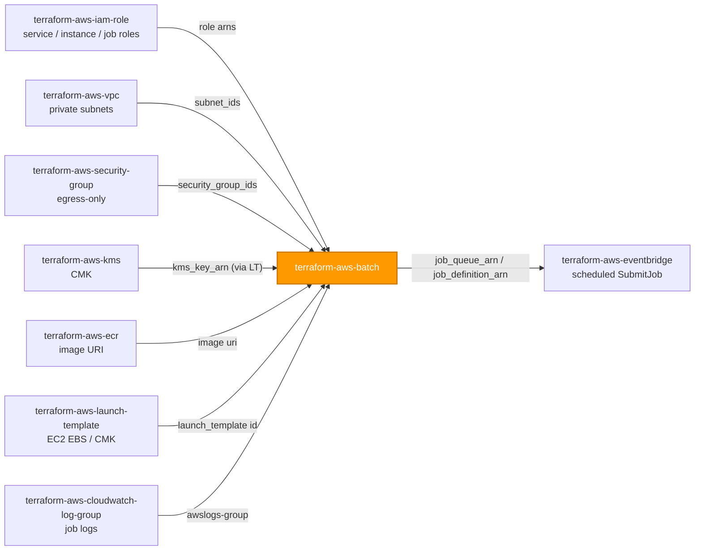
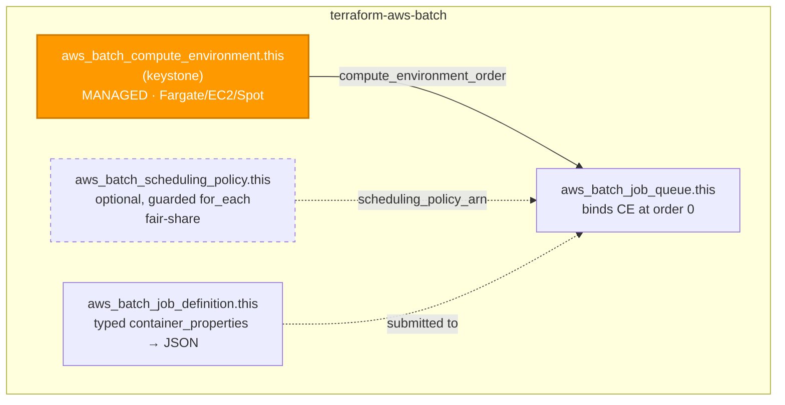

# 🟧 AWS **Batch** Terraform Module

> **Provisions a complete, runnable AWS Batch pipeline — a managed compute environment, a job queue, a job definition, and an optional fair-share scheduling policy — secure-by-default (Fargate, private subnets, read-only root, encrypted storage, `awslogs`) from one module call.** Built for the AWS provider **v6.x**.

[](https://www.terraform.io)
[](https://registry.terraform.io/providers/hashicorp/aws/latest)
[](#)
[](#)
[](#)

---

## 🧩 Overview

- 🧱 **One call, one pipeline.** Creates `aws_batch_compute_environment` (the keystone) plus the resources that are meaningless without it: a job queue bound to it, a job definition registered against it, and — when you ask for it — a fair-share scheduling policy.
- 🐳 **Fargate by default.** No host fleet to patch or scale. Opt into EC2/Spot only when you need GPUs, custom AMIs, or instance-level control.
- 🔐 **Secure container defaults.** Read-only root filesystem, no auto-assigned public IP, distinct execution role (image pull / log push) and job role (in-container AWS access), and `awslogs` to CloudWatch — all on unless you opt out.
- 🌐 **Caller owns roles, networking, and keys.** Subnets, security groups, IAM role ARNs, CMK, ECR image, and log groups are wired in by ARN/URI from sibling modules — this module never creates them.
- 🧬 **Typed container spec, no `any`.** `container_properties` is a deeply-typed `object` rendered into the API's camelCase JSON, so the job definition stays explicit and diff-stable.
- 🏷️ **Tags everywhere.** `var.tags` flows to the compute environment, queue, definition, scheduling policy, and launched EC2 resources, merging with provider `default_tags`; the merged set surfaces as `tags_all`.

> 💡 **Why it matters:** batch workloads at process member/account data on a schedule. A single secure-by-default module keeps the compute private, the storage encrypted, the credentials least-privilege, and the blast radius small — without a hand-assembled tangle of four interdependent resources per pipeline.

---

## ❤️ Support this project

If these Terraform modules have been helpful to you or your organization, I'd appreciate your support in any of the following ways:

- ⭐ **Star this repository** to help others discover this Terraform module.
- 🤝 **Connect with me on LinkedIn:** [linkedin.com/in/microsoftexpert](https://www.linkedin.com/in/microsoftexpert)
- ☕ **Buy me a coffee:** [buymeacoffee.com/microsoftexpert](https://buymeacoffee.com/microsoftexpert)

Whether it's a star, a professional connection, or a coffee, every gesture helps keep these modules actively maintained and continually improving. Thank you for being part of the community!

---

## 🗺️ Where this fits in the family

`terraform-aws-batch` is a **leaf consumer** — it depends on the IAM, networking, KMS, container-registry, and logging foundations, and is itself consumed by orchestration (EventBridge / Step Functions submitting jobs).



---

## 🧬 What this module builds



| Resource | Count | Created when |
|---|---|---|
| `aws_batch_compute_environment.this` | 1 | always (keystone) |
| `aws_batch_job_queue.this` | 1 | always |
| `aws_batch_job_definition.this` | 1 | always |
| `aws_batch_scheduling_policy.this` | 0 or 1 | `scheduling_policy != null` |

---

## ✅ Provider / Versions

| Requirement | Version |
|---|---|
| Terraform | `>= 1.12.0` |
| `hashicorp/aws` | `>= 6.0, < 7.0` |

The module declares only a `required_providers` block (`providers.tf`) and inherits the configured provider. There is **no `provider {}` block** and **no credential variable** — credentials resolve through the standard AWS chain at the root/pipeline level (env vars → SSO/shared credentials → `assume_role` → instance profile / IRSA → OIDC web identity).

> ℹ️ In AWS provider **v6**, `aws_batch_compute_environment` uses `name` / `name_prefix` (the legacy `compute_environment_name` was renamed) and prefers the `AWSServiceRoleForBatch` service-linked role over an explicit `service_role` for MANAGED environments.

---

## 🔑 Required IAM Permissions

Least-privilege actions the **Terraform execution identity** needs to manage this module.

| Action | Required for | Notes |
|---|---|---|
| `batch:CreateComputeEnvironment`, `batch:UpdateComputeEnvironment`, `batch:DeleteComputeEnvironment`, `batch:DescribeComputeEnvironments` | Compute environment lifecycle | Core CRUD |
| `batch:CreateJobQueue`, `batch:UpdateJobQueue`, `batch:DeleteJobQueue`, `batch:DescribeJobQueues` | Job queue lifecycle | Core CRUD |
| `batch:RegisterJobDefinition`, `batch:DeregisterJobDefinition`, `batch:DescribeJobDefinitions` | Job definition | A new revision is registered on every change |
| `batch:CreateSchedulingPolicy`, `batch:DeleteSchedulingPolicy`, `batch:DescribeSchedulingPolicy`, `batch:UpdateSchedulingPolicy` | Fair-share scheduling | Only when `scheduling_policy` is supplied |
| `batch:TagResource`, `batch:UntagResource`, `batch:ListTagsForResource` | Tagging | Applies to all four Batch resources |
| `iam:PassRole` | **Passing roles to Batch** | Scope to the service role, EC2 instance profile, Spot fleet role, and the job definition's execution + job role ARNs — see note below |
| `iam:CreateServiceLinkedRole` | `AWSServiceRoleForBatch` (and EC2 Spot `AWSServiceRoleForEC2Spot` / `…SpotFleet` when applicable) | Auto-created on first MANAGED environment if absent |
| `kms:DescribeKey` | CMK validation | Only when storage/logs use a customer-managed key (`kms_key_arn`) |
| `ec2:Describe*` | Managed compute validation | Subnet / security-group / launch-template lookups during plan/apply |

> ⚠️ **`iam:PassRole` is mandatory for every role Batch consumes.** Restrict it to the exact role ARNs and add an `iam:PassedToService` condition (e.g. `batch.amazonaws.com`, `ecs-tasks.amazonaws.com`, `ec2.amazonaws.com`, `spotfleet.amazonaws.com`) so the identity can only hand those roles to AWS Batch.

> 🔒 Scope the `batch:*` actions to a compute-environment / job-queue / job-definition ARN pattern (e.g. `arn:aws:batch:<region>:<account>:job-queue/casey-*`) rather than `*`.

---

## 📋 AWS Prerequisites

- **Service-linked role.** AWS Batch auto-creates `AWSServiceRoleForBatch` on first use (needs `iam:CreateServiceLinkedRole`). In v6 the provider prefers this SLR over an explicit `service_role` for MANAGED environments — leave `service_role_arn` null unless you must override it. The SLR can only be deleted after all compute environments are deleted ([using service-linked roles for Batch](https://docs.aws.amazon.com/batch/latest/userguide/using-service-linked-roles-batch-general.html)).
- **`iam:PassRole`** for: the Batch service role (if explicit), the EC2 instance profile (EC2/Spot compute), the Spot fleet role `AmazonEC2SpotFleetTaggingRole` (Spot only — [Spot fleet roles](https://docs.aws.amazon.com/batch/latest/userguide/spot-fleet-roles-cli.html)), and the job definition's execution role + job role.
- **Networking.** Subnets and security groups must exist in the target VPC. Fargate uses `awsvpc` networking and needs outbound reachability to ECR / STS / CloudWatch Logs — use **private subnets with a NAT gateway or interface VPC endpoints**, never an inbound public path. Security groups attached to Fargate compute are **required**.
- **Container image.** The image referenced by `container_properties.image` must be reachable from the compute environment (ECR pull permissions on the execution role; network path to the registry).
- **CMK (optional, default-on posture).** EC2 EBS / managed storage and log encryption can use a CMK. The CMK is set on the **EC2 launch template** (`terraform-aws-launch-template`) for EC2/Spot, or via the log group for `awslogs`; Fargate ephemeral storage is AWS-managed-encrypted automatically.
- **Region constraint.** None — AWS Batch is a regional service with no us-east-1 global coupling. The module declares no `region` variable; it inherits the caller's provider.
- **Service quotas** (fixed, per-Region — [AWS Batch service quotas](https://docs.aws.amazon.com/batch/latest/userguide/service_limits.html)):
 - **50** compute environments across ECS + EKS · **50** job queues · **5** compute environments per EKS cluster.
 - **3** compute environments bindable per job queue.
 - Job-definition size ≤ **24 KiB** (`RegisterJobDefinition`); array-job size ≤ **10,000**.
 - EC2/Spot **vCPU service quotas** (separate, adjustable) bound `compute_resources.max_vcpus`.

---

## 📁 Module Structure

```
terraform-aws-batch/
├── providers.tf # required_providers (aws >= 6.0, < 7.0); no provider block
├── variables.tf # name → CE config → roles → compute_resources → queue → job_definition → scheduling_policy → tags
├── main.tf # compute environment + queue + definition (+ optional scheduling policy); container_properties rendered in locals
├── outputs.tf # id + arn + name + job_queue_* + job_definition_* + scheduling_policy_* + tags_all
├── README.md # this file
└── SCOPE.md # in/out-of-scope, IAM permissions, prerequisites, gotchas
```

---

## ⚙️ Quick Start

Smallest working call — a Fargate compute environment, a queue, and a job definition. Networking and roles are wired from upstream modules:

```hcl
module "etl_batch" {
  source = "git::https://github.com/microsoftexpert/terraform-aws-batch?ref=v1.0.0"

  name               = "casey-etl"
  subnet_ids         = module.vpc.private_subnet_ids # from terraform-aws-vpc
  security_group_ids = [module.batch_sg.id]          # from terraform-aws-security-group

  # compute_resources defaults to Fargate, max 16 vCPU — secure default.

  job_queue = {
    name = "casey-etl-queue"
  }

  job_definition = {
    name = "casey-etl-job"
    container_properties = {
      image              = "${module.ecr.repository_url}:latest" # from terraform-aws-ecr
      execution_role_arn = module.exec_role.arn                  # ECR pull / log push
      job_role_arn       = module.job_role.arn                   # in-container AWS access
      vcpu               = "0.5"
      memory             = "1024"
    }
  }

  tags = {
    Environment = "prod"
    CostCenter  = "1234"
  }
}
```

---

## 🔌 Cross-Module Contract

### Consumes

| Input | Type | Source module |
|---|---|---|
| `subnet_ids` | `list(string)` | `terraform-aws-vpc` |
| `security_group_ids` | `list(string)` | `terraform-aws-security-group` |
| `service_role_arn` *(optional with SLR)* | `string` (IAM role ARN) | `terraform-aws-iam-role` |
| `instance_role_arn` *(EC2/Spot only)* | `string` (instance-profile ARN) | `terraform-aws-iam-role` |
| `spot_iam_fleet_role_arn` *(Spot only)* | `string` (IAM role ARN) | `terraform-aws-iam-role` |
| `job_definition.container_properties.execution_role_arn` / `.job_role_arn` | `string` (IAM role ARN) | `terraform-aws-iam-role` |
| `job_definition.container_properties.image` | `string` (image URI) | `terraform-aws-ecr` |
| `compute_resources.launch_template` *(EC2/Spot, CMK-encrypted EBS)* | `object` (LT id/name/version) | `terraform-aws-launch-template` |
| `eks_configuration.eks_cluster_arn` *(EKS-on-Batch)* | `string` (EKS cluster ARN) | `terraform-aws-eks` |
| job log group (via `log_configuration.options["awslogs-group"]`) | `string` (log-group name) | `terraform-aws-cloudwatch-log-group` |

### Emits

| Output | Description | Consumed by |
|---|---|---|
| `id` | Compute environment id (its ARN; Batch uses the ARN as the id) | references |
| `arn` | Compute environment ARN `arn:aws:batch:<region>:<account>:compute-environment/<name>` — the cross-resource reference type | IAM policies, monitoring, queue bindings |
| `name` | Compute environment name (generated when `name`/`name_prefix` null) | inspection |
| `ecs_cluster_arn` | ARN of the underlying ECS cluster backing the environment | monitoring / inspection |
| `status` | Current CE status (`CREATING`, `VALID`, …) | health checks |
| `job_queue_arn` / `job_queue_id` | Job queue ARN (id == arn) | `SubmitJob`, EventBridge / Step Functions targets |
| `job_queue_name` | Job queue name | job submission |
| `job_definition_arn` | Job definition ARN `…:job-definition/<name>:<revision>` | `SubmitJob`, EventBridge targets |
| `job_definition_name` / `job_definition_revision` | Definition name + current revision | submission / audit |
| `scheduling_policy_arn` / `scheduling_policy_name` | Fair-share policy attributes when created; else `null` | queue binding |
| `tags_all` | All tags incl. provider `default_tags` (resource tags win) | governance/audit |

---

## 📚 Example Library

<details>
<summary><strong>1 · Minimal Fargate pipeline (CE + queue + definition)</strong></summary>

```hcl
module "batch" {
  source = "git::https://github.com/microsoftexpert/terraform-aws-batch?ref=v1.0.0"

  name               = "casey-fargate"
  subnet_ids         = module.vpc.private_subnet_ids
  security_group_ids = [module.batch_sg.id]

  job_queue = { name = "casey-fargate-queue" }

  job_definition = {
    name = "casey-fargate-job"
    container_properties = {
      image              = "${module.ecr.repository_url}:latest"
      execution_role_arn = module.exec_role.arn
      job_role_arn       = module.job_role.arn
    }
  }
}
```
</details>

<details>
<summary><strong>2 · Wire networking from <code>terraform-aws-vpc</code> + <code>terraform-aws-security-group</code></strong></summary>

```hcl
module "vpc" {
  source = "git::https://github.com/microsoftexpert/terraform-aws-vpc?ref=v1.0.0"
  #... emits private_subnet_ids
}

module "batch_sg" {
  source = "git::https://github.com/microsoftexpert/terraform-aws-security-group?ref=v1.0.0"
  vpc_id = module.vpc.id
  # egress-only: Batch workloads pull images and call APIs outbound; no ingress
}

module "batch" {
  source             = "git::https://github.com/microsoftexpert/terraform-aws-batch?ref=v1.0.0"
  name               = "casey-private"
  subnet_ids         = module.vpc.private_subnet_ids # private subnets — secure default
  security_group_ids = [module.batch_sg.id]

  job_queue = { name = "casey-private-queue" }
  job_definition = {
    name                 = "casey-private-job"
    container_properties = { image = "${module.ecr.repository_url}:latest" }
  }
}
```
</details>

<details>
<summary><strong>3 · Distinct execution role + job role from <code>terraform-aws-iam-role</code></strong></summary>

```hcl
# Execution role: ECR pull + CloudWatch Logs push (AWS-managed policy)
module "exec_role" {
  source              = "git::https://github.com/microsoftexpert/terraform-aws-iam-role?ref=v1.0.0"
  name                = "casey-batch-exec"
  assume_role_policy  = data.aws_iam_policy_document.ecs_tasks_trust.json
  managed_policy_arns = ["arn:aws:iam::aws:policy/service-role/AmazonECSTaskExecutionRolePolicy"]
}

# Job role: least-privilege in-container AWS access (e.g. one S3 prefix)
module "job_role" {
  source              = "git::https://github.com/microsoftexpert/terraform-aws-iam-role?ref=v1.0.0"
  name                = "casey-batch-job"
  assume_role_policy  = data.aws_iam_policy_document.ecs_tasks_trust.json
  managed_policy_arns = [module.s3_read_policy.arn]
}

module "batch" {
  source             = "git::https://github.com/microsoftexpert/terraform-aws-batch?ref=v1.0.0"
  name               = "casey-roles"
  subnet_ids         = module.vpc.private_subnet_ids
  security_group_ids = [module.batch_sg.id]
  job_queue          = { name = "casey-roles-queue" }

  job_definition = {
    name = "casey-roles-job"
    container_properties = {
      image              = "${module.ecr.repository_url}:latest"
      execution_role_arn = module.exec_role.arn # pull + log push
      job_role_arn       = module.job_role.arn  # app permissions — separate, least-privilege
    }
  }
}
```
</details>

<details>
<summary><strong>4 · Image from <code>terraform-aws-ecr</code> + logs to <code>terraform-aws-cloudwatch-log-group</code></strong></summary>

```hcl
module "batch" {
  source             = "git::https://github.com/microsoftexpert/terraform-aws-batch?ref=v1.0.0"
  name               = "casey-logged"
  subnet_ids         = module.vpc.private_subnet_ids
  security_group_ids = [module.batch_sg.id]
  job_queue          = { name = "casey-logged-queue" }

  job_definition = {
    name = "casey-logged-job"
    container_properties = {
      image              = "${module.ecr.repository_url}:v2.3.1" # pinned tag, from terraform-aws-ecr
      execution_role_arn = module.exec_role.arn
      log_configuration = {
        log_driver = "awslogs" # secure default
        options = {
          "awslogs-group"         = module.job_logs.name # from terraform-aws-cloudwatch-log-group
          "awslogs-region"        = "us-east-1"
          "awslogs-stream-prefix" = "casey-logged"
        }
      }
    }
  }
}
```
</details>

<details>
<summary><strong>5 · Tags (merge with provider <code>default_tags</code>)</strong></summary>

```hcl
# Caller's provider block owns default_tags; the module never sets it.
provider "aws" {
  default_tags { tags = { Owner = "platform", ManagedBy = "terraform" } }
}

module "batch" {
  source             = "git::https://github.com/microsoftexpert/terraform-aws-batch?ref=v1.0.0"
  name               = "casey-tagged"
  subnet_ids         = module.vpc.private_subnet_ids
  security_group_ids = [module.batch_sg.id]
  job_queue          = { name = "casey-tagged-queue" }
  job_definition = {
    name                 = "casey-tagged-job"
    container_properties = { image = "${module.ecr.repository_url}:latest" }
  }

  tags = {
    Environment = "prod" # resource tag — wins over default_tags on key conflict
    DataClass   = "internal"
  }
}

# module.batch.tags_all == { Owner, ManagedBy, Environment, DataClass }
```
</details>

<details>
<summary><strong>6 · Per-resource tag overrides</strong></summary>

```hcl
module "batch" {
  source             = "git::https://github.com/microsoftexpert/terraform-aws-batch?ref=v1.0.0"
  name               = "casey-team"
  subnet_ids         = module.vpc.private_subnet_ids
  security_group_ids = [module.batch_sg.id]

  tags = { Environment = "prod", Team = "data" }

  job_queue = {
    name = "casey-team-queue"
    tags = { Tier = "queue" } # merged over module tags for the queue
  }
  job_definition = {
    name                 = "casey-team-job"
    tags                 = { Tier = "definition" } # merged over module tags for the definition
    container_properties = { image = "${module.ecr.repository_url}:latest" }
  }
}
```
</details>

<details>
<summary><strong>7 · EC2 On-Demand compute (opt out of Fargate)</strong></summary>

```hcl
module "batch_ec2" {
  source             = "git::https://github.com/microsoftexpert/terraform-aws-batch?ref=v1.0.0"
  name               = "casey-ec2"
  subnet_ids         = module.vpc.private_subnet_ids
  security_group_ids = [module.batch_sg.id]

  instance_role_arn = module.ecs_instance_role.instance_profile_arn # required for EC2

  compute_resources = {
    type                = "EC2"
    allocation_strategy = "BEST_FIT_PROGRESSIVE"
    min_vcpus           = 0
    desired_vcpus       = 0
    max_vcpus           = 64
    instance_types      = ["c6i.large", "c6i.xlarge"]
  }

  job_queue = { name = "casey-ec2-queue" }
  job_definition = {
    name                  = "casey-ec2-job"
    platform_capabilities = ["EC2"]
    container_properties = {
      image        = "${module.ecr.repository_url}:latest"
      job_role_arn = module.job_role.arn
      vcpu         = "2"
      memory       = "4096"
    }
  }
}
```
</details>

<details>
<summary><strong>8 · Spot compute with bid percentage + Spot fleet role</strong></summary>

```hcl
module "batch_spot" {
  source             = "git::https://github.com/microsoftexpert/terraform-aws-batch?ref=v1.0.0"
  name               = "casey-spot"
  subnet_ids         = module.vpc.private_subnet_ids
  security_group_ids = [module.batch_sg.id]

  instance_role_arn       = module.ecs_instance_role.instance_profile_arn
  spot_iam_fleet_role_arn = module.spot_fleet_role.arn # AmazonEC2SpotFleetTaggingRole — Spot only

  compute_resources = {
    type                = "SPOT"
    allocation_strategy = "SPOT_PRICE_CAPACITY_OPTIMIZED"
    bid_percentage      = 60 # max 60% of On-Demand price
    min_vcpus           = 0
    max_vcpus           = 256
    instance_types      = ["optimal"]
  }

  job_queue = { name = "casey-spot-queue" }
  job_definition = {
    name                  = "casey-spot-job"
    platform_capabilities = ["EC2"]
    container_properties  = { image = "${module.ecr.repository_url}:latest" }
  }
}
```
</details>

<details>
<summary><strong>9 · EC2/Spot EBS encrypted with a CMK via <code>terraform-aws-launch-template</code></strong></summary>

```hcl
# The launch template is where CMK-encrypted EBS lives for EC2/Spot Batch compute.
module "batch_lt" {
  source          = "git::https://github.com/microsoftexpert/terraform-aws-launch-template?ref=v1.0.0"
  name            = "casey-batch-lt"
  ebs_kms_key_arn = module.kms.arn # customer-managed CMK from terraform-aws-kms
  ebs_encrypted   = true
}

module "batch" {
  source             = "git::https://github.com/microsoftexpert/terraform-aws-batch?ref=v1.0.0"
  name               = "casey-cmk"
  subnet_ids         = module.vpc.private_subnet_ids
  security_group_ids = [module.batch_sg.id]
  instance_role_arn  = module.ecs_instance_role.instance_profile_arn

  compute_resources = {
    type      = "EC2"
    max_vcpus = 32
    launch_template = {
      launch_template_id = module.batch_lt.id # encrypted EBS applied to launched instances
      version            = "$Latest"
    }
  }

  job_queue = { name = "casey-cmk-queue" }
  job_definition = {
    name                  = "casey-cmk-job"
    platform_capabilities = ["EC2"]
    container_properties  = { image = "${module.ecr.repository_url}:latest" }
  }
}
```
</details>

<details>
<summary><strong>10 · Secrets from Secrets Manager (never plaintext env)</strong></summary>

```hcl
module "batch" {
  source             = "git::https://github.com/microsoftexpert/terraform-aws-batch?ref=v1.0.0"
  name               = "casey-secrets"
  subnet_ids         = module.vpc.private_subnet_ids
  security_group_ids = [module.batch_sg.id]
  job_queue          = { name = "casey-secrets-queue" }

  job_definition = {
    name = "casey-secrets-job"
    container_properties = {
      image              = "${module.ecr.repository_url}:latest"
      execution_role_arn = module.exec_role.arn # must have secretsmanager:GetSecretValue
      job_role_arn       = module.job_role.arn

      environment = { LOG_LEVEL = "info" } # plain config only — NEVER secrets

      secrets = {
        DB_PASSWORD = module.db_secret.arn # Secrets Manager ARN from terraform-aws-secrets-manager
        API_KEY     = "${module.api_secret.arn}:key::"
      }
    }
  }
}
```
</details>

<details>
<summary><strong>11 · Retry strategy + timeout</strong></summary>

```hcl
module "batch" {
  source             = "git::https://github.com/microsoftexpert/terraform-aws-batch?ref=v1.0.0"
  name               = "casey-resilient"
  subnet_ids         = module.vpc.private_subnet_ids
  security_group_ids = [module.batch_sg.id]
  job_queue          = { name = "casey-resilient-queue" }

  job_definition = {
    name = "casey-resilient-job"
    retry_strategy = {
      attempts = 3
      evaluate_on_exit = [
        { action = "RETRY", on_exit_code = "1" }, # retry transient failures
        { action = "EXIT", on_reason = "*" },     # give up on everything else
      ]
    }
    timeout              = { attempt_duration_seconds = 3600 } # kill a hung attempt after 1h (>= 60s)
    container_properties = { image = "${module.ecr.repository_url}:latest" }
  }
}
```
</details>

<details>
<summary><strong>12 · Fair-share scheduling policy (auto-bound to the queue)</strong></summary>

```hcl
module "batch" {
  source             = "git::https://github.com/microsoftexpert/terraform-aws-batch?ref=v1.0.0"
  name               = "casey-fairshare"
  subnet_ids         = module.vpc.private_subnet_ids
  security_group_ids = [module.batch_sg.id]

  scheduling_policy = {
    name = "casey-tenant-fairshare"
    fair_share_policy = {
      compute_reservation = 10 # reserve 10% of queue vCPUs for unused identifiers
      share_decay_seconds = 3600
      share_distribution = [
        { share_identifier = "tenant-a", weight_factor = 1 }, # lower weight = more vCPUs
        { share_identifier = "tenant-b", weight_factor = 3 },
      ]
    }
  }

  job_queue = { name = "casey-fairshare-queue" } # auto-binds to the policy above
  job_definition = {
    name                 = "casey-fairshare-job"
    scheduling_priority  = 100 # required within a fair-share queue
    container_properties = { image = "${module.ecr.repository_url}:latest" }
  }
}
```
</details>

<details>
<summary><strong>13 · Encrypted EFS volume mounted into the job</strong></summary>

```hcl
module "batch" {
  source             = "git::https://github.com/microsoftexpert/terraform-aws-batch?ref=v1.0.0"
  name               = "casey-efs"
  subnet_ids         = module.vpc.private_subnet_ids
  security_group_ids = [module.batch_sg.id]
  job_queue          = { name = "casey-efs-queue" }

  job_definition = {
    name = "casey-efs-job"
    container_properties = {
      image = "${module.ecr.repository_url}:latest"
      volumes = [{
        name = "shared"
        efs_volume_configuration = {
          file_system_id     = module.efs.id # from terraform-aws-efs
          transit_encryption = "ENABLED"     # secure default
          access_point_id    = module.efs.access_point_id
          iam                = "ENABLED"
        }
      }]
      mount_points = [{ source_volume = "shared", container_path = "/data", read_only = false }]
    }
  }
}
```
</details>

<details>
<summary><strong>14 · Job-state time-limit action (cancel stuck RUNNABLE jobs)</strong></summary>

```hcl
module "batch" {
  source             = "git::https://github.com/microsoftexpert/terraform-aws-batch?ref=v1.0.0"
  name               = "casey-bounded"
  subnet_ids         = module.vpc.private_subnet_ids
  security_group_ids = [module.batch_sg.id]

  job_queue = {
    name     = "casey-bounded-queue"
    priority = 10
    job_state_time_limit_action = [{
      action           = "CANCEL"
      state            = "RUNNABLE"
      max_time_seconds = 600 # cancel jobs stuck waiting on capacity for 10 min
      reason           = "stuck-on-capacity"
    }]
  }

  job_definition = {
    name                 = "casey-bounded-job"
    container_properties = { image = "${module.ecr.repository_url}:latest" }
  }
}
```
</details>

<details>
<summary><strong>15 · End-to-end composition — secure batch pipeline + scheduled trigger</strong></summary>

```hcl
# ── Foundations ─────────────────────────────────────────────────────────────
module "vpc" {
  source = "git::https://github.com/microsoftexpert/terraform-aws-vpc?ref=v1.0.0"
  #... emits private_subnet_ids
}

module "batch_sg" {
  source = "git::https://github.com/microsoftexpert/terraform-aws-security-group?ref=v1.0.0"
  vpc_id = module.vpc.id # egress-only
}

module "kms" {
  source = "git::https://github.com/microsoftexpert/terraform-aws-kms?ref=v1.0.0"
  alias  = "casey/batch"
}

module "ecr" {
  source = "git::https://github.com/microsoftexpert/terraform-aws-ecr?ref=v1.0.0"
  name   = "casey-etl"
}

module "job_logs" {
  source            = "git::https://github.com/microsoftexpert/terraform-aws-cloudwatch-log-group?ref=v1.0.0"
  name              = "/casey/batch/etl"
  kms_key_arn       = module.kms.arn
  retention_in_days = 90
}

module "exec_role" {
  source              = "git::https://github.com/microsoftexpert/terraform-aws-iam-role?ref=v1.0.0"
  name                = "casey-batch-exec"
  assume_role_policy  = data.aws_iam_policy_document.ecs_tasks_trust.json
  managed_policy_arns = ["arn:aws:iam::aws:policy/service-role/AmazonECSTaskExecutionRolePolicy"]
}

module "job_role" {
  source              = "git::https://github.com/microsoftexpert/terraform-aws-iam-role?ref=v1.0.0"
  name                = "casey-batch-job"
  assume_role_policy  = data.aws_iam_policy_document.ecs_tasks_trust.json
  managed_policy_arns = [module.data_policy.arn]
}

# ── This module — runnable Fargate pipeline ───────────────────────────────────
module "batch" {
  source             = "git::https://github.com/microsoftexpert/terraform-aws-batch?ref=v1.0.0"
  name               = "casey-etl"
  subnet_ids         = module.vpc.private_subnet_ids # private — secure default
  security_group_ids = [module.batch_sg.id]          # egress-only

  job_queue = { name = "casey-etl-queue", priority = 1 }

  job_definition = {
    name = "casey-etl-job"
    container_properties = {
      image                    = "${module.ecr.repository_url}:v1.4.0"
      execution_role_arn       = module.exec_role.arn
      job_role_arn             = module.job_role.arn
      vcpu                     = "1"
      memory                   = "2048"
      user                     = "1000:1000" # non-root
      readonly_root_filesystem = true        # secure default (explicit here)
      assign_public_ip         = false       # secure default (explicit here)
      log_configuration = {
        log_driver = "awslogs"
        options = {
          "awslogs-group"         = module.job_logs.name
          "awslogs-region"        = "us-east-1"
          "awslogs-stream-prefix" = "etl"
        }
      }
    }
  }

  tags = { Environment = "prod", DataClass = "confidential" }
}

# ── Scheduled submission via EventBridge ──────────────────────────────────────
module "nightly_trigger" {
  source               = "git::https://github.com/microsoftexpert/terraform-aws-eventbridge?ref=v1.0.0"
  rule_name            = "casey-etl-nightly"
  schedule_expression  = "cron(0 3 * * ? *)"
  target_arn           = module.batch.job_queue_arn      # submit to the queue
  batch_job_definition = module.batch.job_definition_arn # this revision's ARN
}
```
</details>

---

## 📥 Inputs

| Name | Type | Default | Description |
|---|---|---|---|
| `name` | `string` | `null` | Compute environment name. **FORCE-NEW.** Mutually exclusive with `name_prefix`. |
| `name_prefix` | `string` | `null` | Unique-name prefix. **FORCE-NEW.** Conflicts with `name`. |
| `compute_environment_type` | `string` | `"MANAGED"` | `MANAGED` (Batch provisions/scales) or `UNMANAGED`. |
| `state` | `string` | `"ENABLED"` | `ENABLED` / `DISABLED`. Must be `DISABLED` (and detached) to delete. |
| `subnet_ids` | `list(string)` | `[]` | Private subnets for managed compute (required for MANAGED). |
| `security_group_ids` | `list(string)` | `[]` | Egress-only SGs (required for Fargate). |
| `service_role_arn` | `string` (ARN) | `null` | Batch service role; `null` → use `AWSServiceRoleForBatch` SLR (preferred). |
| `instance_role_arn` | `string` (ARN) | `null` | ECS instance profile (EC2/Spot only). |
| `spot_iam_fleet_role_arn` | `string` (ARN) | `null` | Spot fleet role (SPOT only). |
| `compute_resources` | `object({...})` | Fargate, 16 vCPU | Managed compute spec (type, vCPUs, allocation, instance types, launch template, …). |
| `eks_configuration` | `object({...})` | `null` | EKS-on-Batch backing cluster. |
| `update_policy` | `object({...})` | `null` | In-place update behavior for running jobs. |
| `job_queue` | `object({...})` | — **required** | Queue name, priority, state, policy/CE bindings, state-time-limit actions. |
| `job_definition` | `object({...})` | — **required** | Definition + typed `container_properties` (image, roles, resources, logging, volumes, secrets, …). |
| `scheduling_policy` | `object({...})` | `null` | Optional fair-share policy, auto-bound to the queue. |
| `tags` | `map(string)` | `{}` | Tags for all taggable resources (merge with `default_tags`). |

See `variables.tf` for full heredoc schemas and validation rules.

---

## 🧾 Outputs

| Name | Description |
|---|---|
| `id` | Compute environment id (its ARN). |
| `arn` | Compute environment ARN (cross-resource reference type). |
| `name` | Compute environment name. |
| `ecs_cluster_arn` | Underlying ECS cluster ARN. |
| `status` | Current CE status. |
| `job_queue_id` / `job_queue_arn` / `job_queue_name` | Job queue attributes (id == arn). |
| `job_definition_arn` / `job_definition_name` / `job_definition_revision` | Job definition attributes (ARN includes revision). |
| `scheduling_policy_arn` / `scheduling_policy_name` | Fair-share policy attributes when created; else `null`. |
| `tags_all` | All tags incl. provider `default_tags`. |

---

## 🧠 Architecture Notes

- **ARN formats.** CE: `arn:aws:batch:<region>:<account>:compute-environment/<name>`. Queue: `arn:aws:batch:<region>:<account>:job-queue/<name>`. Definition: `arn:aws:batch:<region>:<account>:job-definition/<name>:<revision>` — **the revision is part of the ARN**. Scheduling policy: `arn:aws:batch:<region>:<account>:scheduling-policy/<name>`.
- **ID formats.** AWS Batch uses the **ARN as the resource id** for the compute environment and job queue (`output "id"` == the CE ARN; `job_queue_id` is sourced from `arn` since the provider deprecated the separate id attribute).
- **Force-new fields.** `name` / `name_prefix` on the compute environment force replacement, as do several `compute_resources` fields (`type`, `subnets`, allocation strategy). Changing them destroys and recreates the CE, which forces the queue that binds to it to re-point. Prefer `name_prefix` for generated/ephemeral environments.
- **Job-definition revisions.** `aws_batch_job_definition` is **immutable per revision** — any field change registers a **new revision** and a new `job_definition_arn`. With `deregister_on_new_revision = true` (default) the prior revision is deregistered. `container_properties` is rendered to normalized camelCase JSON in `main.tf` locals, omitting unset keys so no perpetual diff appears.
- **`tags` ↔ `tags_all` ↔ `default_tags`.** `var.tags` is applied to every taggable Batch resource; per-resource tags inside `job_queue` / `job_definition` / `scheduling_policy` / `compute_resources` merge **over** module tags. `tags_all` is the provider-computed merge of resource tags over provider `default_tags`, with **resource tags winning** on key conflict. `default_tags` is the caller's concern — never set inside this module.
- **Eventual consistency.** A freshly created IAM role / instance profile may not be immediately assumable; CE creation can transiently fail with `InvalidParameterValue` and succeed on retry. The SLR may also lag on first use.
- **Destroy ordering.** A compute environment **in use by a queue cannot be deleted**. Terraform's graph disables/detaches in order, but if a destroy stalls: disable the queue → wait for in-flight jobs to drain → disable then delete the CE. A CE must be `DISABLED` (and detached from every queue) before deletion.
- **us-east-1 globals.** N/A — AWS Batch is regional with no global-service coupling. No `region` variable; the module inherits the caller's provider/alias.

---

## 🧱 Design Principles

Secure-by-default posture and every opt-out, explicitly:

| Posture | Default | Opt-out |
|---|---|---|
| Capacity type | **Fargate** (no host to patch/scale) | `compute_resources.type = "EC2"` / `"SPOT"` |
| Networking | private subnets, **no auto-assigned public IP** (`assign_public_ip = false`) | public subnet + `assign_public_ip = true` (discouraged) |
| Container filesystem | **read-only root** (`readonly_root_filesystem = true`) | set `false` |
| Privilege | `privileged = false`; `user` runs as supplied non-root | set `privileged = true` / omit `user` (discouraged) |
| Storage encryption | Fargate ephemeral storage AWS-managed-encrypted; EC2/Spot EBS via CMK in the launch template | n/a (Fargate) / set CMK on the LT |
| EFS in-transit | `transit_encryption = "ENABLED"` on EFS volumes | set `"DISABLED"` (discouraged) |
| Job logging | `awslogs` → CloudWatch | alternate `log_driver` |
| Least-privilege identity | distinct `execution_role_arn` + `job_role_arn`; Batch SLR over explicit service role | supply a single role / explicit `service_role_arn` |
| Secrets | `secrets` (Secrets Manager / SSM ARNs) | `environment` plaintext (forbidden for secrets) |
| Service role | `AWSServiceRoleForBatch` SLR (provider-preferred) | explicit `service_role_arn` |
| Region | none (regional, inherits provider) | use a provider alias for a different region |

Other principles:
- **One composite, one keystone.** The compute environment owns the resources meaningless without it (queue, definition, optional scheduling policy). Roles, networking, CMK, image, and log group are referenced by ARN/URI from sibling modules, keeping blast radius to the pipeline itself.
- **`for_each`, never `count`,** and `dynamic` blocks for every optional/repeating block (compute resources, EKS, update policy, fair-share distribution, retry/timeout, queue orderings).
- **Typed `container_properties`, no `any`** — rendered to the API's JSON in locals so the definition stays explicit and diff-stable.
- **Primary outputs `id` + `arn`**, plus queue/definition/policy attributes and `tags_all`.

---

## 🚀 Runbook

```powershell
# Validate without backend or credentials
terraform init -backend=false
terraform validate
terraform fmt -check
```

> `plan` / `apply` require valid AWS credentials (profile / SSO / OIDC) resolved through the standard provider chain, a configured region, and the IAM actions listed above (notably `iam:PassRole` for every role Batch consumes).

---

## 🧪 Testing

- `terraform init -backend=false && terraform validate` — schema + reference integrity, including the rendered `container_properties` JSON.
- `terraform fmt -check` — canonical formatting.
- `terraform plan` against a sandbox account to confirm the CE reaches `VALID`, the queue binds at order 0, and the job definition registers a revision.
- Assert `module.batch.arn`, `job_queue_arn`, `job_definition_arn`, `job_definition_revision`, and `tags_all` in your root-module test harness.
- Submit a smoke job (`aws batch submit-job --job-queue … --job-definition …`) and confirm it reaches `SUCCEEDED` with logs in the expected CloudWatch group.

---

## 💬 Example Output

```text
module.batch.aws_batch_compute_environment.this: Creation complete after 38s [id=arn:aws:batch:us-east-1:123456789012:compute-environment/casey-etl]
module.batch.aws_batch_job_definition.this: Creation complete [id=arn:aws:batch:us-east-1:123456789012:job-definition/casey-etl-job:1]
module.batch.aws_batch_job_queue.this: Creation complete after 6s [id=arn:aws:batch:us-east-1:123456789012:job-queue/casey-etl-queue]

Outputs:
arn = "arn:aws:batch:us-east-1:123456789012:compute-environment/casey-etl"
job_queue_arn = "arn:aws:batch:us-east-1:123456789012:job-queue/casey-etl-queue"
job_definition_arn = "arn:aws:batch:us-east-1:123456789012:job-definition/casey-etl-job:1"
job_definition_revision = 1
status = "VALID"
tags_all = { "DataClass" = "confidential", "Environment" = "prod" }
```

---

## 🔍 Troubleshooting

| Symptom | Likely cause | Fix |
|---|---|---|
| CE stuck `INVALID` after create | Service role / instance profile not assumable, or subnets lack outbound path to ECR/STS | Check role trust + `iam:PassRole`; ensure private subnets have NAT or interface VPC endpoints |
| `AccessDenied: iam:PassRole` on apply | Identity can't pass a role to Batch | Grant `iam:PassRole` on the exact role ARNs with an `iam:PassedToService` condition |
| `Cannot delete, found existing JobQueue relationship` on destroy | CE still bound to an active queue | Disable the queue, let jobs drain, then disable + delete the CE |
| Perpetual diff on `container_properties` | Out-of-band edit, or a field set to a non-canonical value | Let the module own the definition; the rendered JSON omits unset keys to stay stable |
| New job-definition revision every plan | A `container_properties` field genuinely changed | Expected — definitions are immutable per revision; pin the input to stop churn |
| Fargate job fails to pull image | No network path to ECR, or execution role lacks pull rights | Add interface VPC endpoints / NAT; attach `AmazonECSTaskExecutionRolePolicy` to the execution role |
| Tag drift on every plan | A tag also set by provider `default_tags` with a different value | Let resource tags win, or remove the overlap from `default_tags` |
| `Error: error creating Batch Compute Environment: … security group` (Fargate) | `security_group_ids` empty for a Fargate CE | Supply at least one egress-only security group |
| Jobs sit in `RUNNABLE` forever | `max_vcpus` too low, vCPU service quota exhausted, or no instance type matches | Raise `max_vcpus`, request a vCPU quota increase, or widen `instance_types` |
| `CreateServiceLinkedRole` denied | Identity lacks SLR permission and `AWSServiceRoleForBatch` absent | Grant `iam:CreateServiceLinkedRole`, or pre-create the SLR |

---

## 🔗 Related Docs

- [AWS Batch service quotas](https://docs.aws.amazon.com/batch/latest/userguide/service_limits.html)
- [Using service-linked roles for AWS Batch](https://docs.aws.amazon.com/batch/latest/userguide/using-service-linked-roles-batch-general.html)
- [Amazon EC2 Spot fleet roles for Batch](https://docs.aws.amazon.com/batch/latest/userguide/spot-fleet-roles-cli.html)
- [Job queues](https://docs.aws.amazon.com/batch/latest/userguide/job_queues.html) · [Compute environments](https://docs.aws.amazon.com/batch/latest/userguide/compute_environments.html)
- Terraform: [`aws_batch_compute_environment`](https://registry.terraform.io/providers/hashicorp/aws/latest/docs/resources/batch_compute_environment) · [`aws_batch_job_queue`](https://registry.terraform.io/providers/hashicorp/aws/latest/docs/resources/batch_job_queue) · [`aws_batch_job_definition`](https://registry.terraform.io/providers/hashicorp/aws/latest/docs/resources/batch_job_definition) · [`aws_batch_scheduling_policy`](https://registry.terraform.io/providers/hashicorp/aws/latest/docs/resources/batch_scheduling_policy)
- Sibling modules: `terraform-aws-iam-role`, `terraform-aws-vpc`, `terraform-aws-security-group`, `terraform-aws-kms`, `terraform-aws-ecr`, `terraform-aws-launch-template`, `terraform-aws-cloudwatch-log-group`, `terraform-aws-eventbridge`
- Module internals: `SCOPE.md`

---

> 🧡 *"Infrastructure as Code should be standardized, consistent, and secure."*
